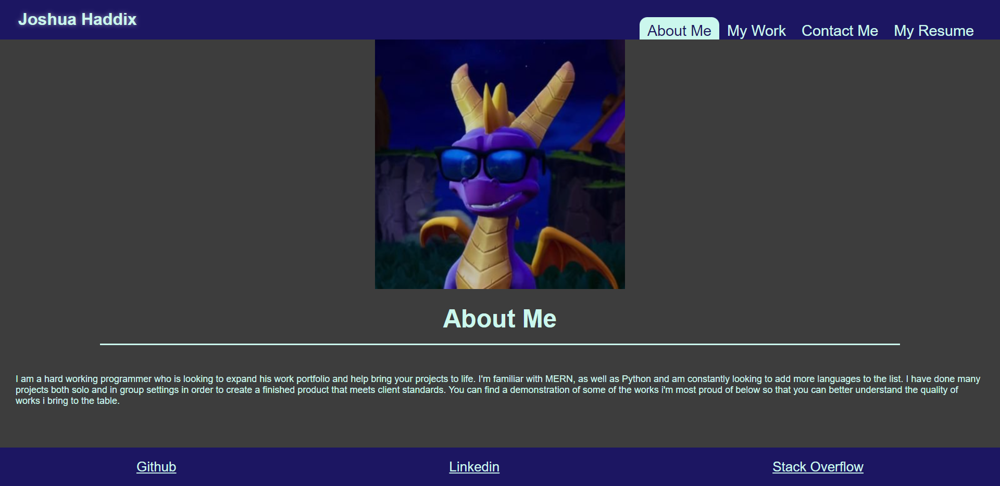

# My Portfolio

## Description

This project is meant to be a brief showcase of my skills as a developer to give potential employers a better idea of my coding expertise

## Table of Contents

- [Installation](#installation)
- [Usage](#usage)
- [Contributing](#Contributing)
- [Tests](#tests)
- [Questions](#questions)

## Installation

N/A

## Usage

https://spyromancy.github.io/react-portfolio/
The different sections will allow employers to learn about myself and my skills by reading the About Me section and seeing what projects i've already completed.

## Contributing

No contributions

## Tests

N/A

## Questions

GitHub: [Spyromancy](https://github.com/Spyromancy)

Email: <josh.haddix598@gmail.com>
